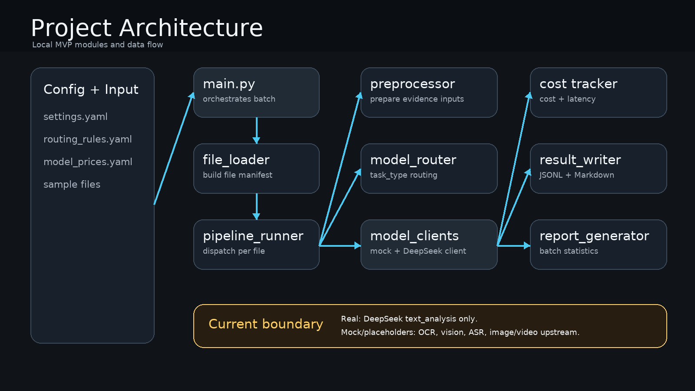

# Multimodal Model Router

## 1. 项目一句话定位

面向内容平台 AI 团队技术负责人的多模态批处理与模型路由 MVP：把文本、图片、视频文件统一接入，拆成 OCR、视觉理解、语音识别、文本分析等任务，并记录每次模型调用的成本、延迟、状态和证据来源。

当前项目不是“全真实多模态平台”。截至当前版本，真实接入的是 DeepSeek 文本分析；OCR、视觉理解、语音识别，以及图片/视频的上游证据提取仍使用 mock 或占位逻辑。

## 2. 为什么做这个项目

内容平台在处理大量图文和视频素材时，技术负责人通常会遇到三个问题：

- 输入不统一：文本、图片、视频需要分别处理，难以形成稳定流水线。
- 输出不统一：不同模型返回格式不同，后续导入系统前还要人工整理。
- 成本和延迟不透明：一次批处理到底调用了哪些模型、花了多少钱、哪一步最慢，通常缺少可追踪记录。

这个项目的价值不在于“又做一个内容分类器”，而在于把模型使用过程产品化：统一输入、统一输出、模型调用留痕、成本核算、延迟统计、证据链追踪。

## 3. 面向谁使用

目标使用者是内容平台或互联网中厂的 AI 团队技术负责人。

典型场景是：团队准备批量处理一批图文和视频素材，需要快速知道每个文件是什么类型、可以进入哪条处理流水线、最终得到什么结构化结果、使用了哪些模型、成本和延迟是否可接受。

## 4. 核心能力

| 能力 | 当前实现情况 | 作品集价值 |
|---|---|---|
| 多类型文件识别 | 已支持文本、图片、视频三类输入 | 体现对多模态业务入口的拆解能力 |
| 任务流水线拆解 | 已按文件类型进入不同处理流程 | 体现把业务问题拆成工程模块的能力 |
| 模型路由 | 首期按任务类型选择模型，暂未做动态优化 | 体现模型选型和供应商路由意识 |
| DeepSeek 文本分析 | 已可真实调用 DeepSeek API | 体现真实模型接入、提示词约束和结构化输出能力 |
| 成本统计 | 已记录单次调用成本、文件级成本、批次总成本 | 体现 AI 产经中的预算和成本意识 |
| 延迟统计 | 已记录单次调用延迟、文件级耗时和 P95 延迟 | 体现工程指标意识 |
| 证据链追踪 | 已记录结果基于哪些证据、缺少哪些证据 | 体现对模型结果可信度的判断能力 |
| 模型组合建议 | 已可基于既有批次输出生成策略报告 | 体现把成本、延迟和真实/mock 边界转成模型选型建议的产经分析能力 |
| 可读 Demo 输出 | 已生成 `results_readable.md` | 方便招聘方不用跑代码也能看懂结果 |

## 5. 系统流程



```text
输入文件夹
  ↓
文件加载与类型识别
  ↓
按 media_type 分流
  ├─ 文本：读取原文 → 文本分析
  ├─ 图片：OCR / 视觉理解 → 文本分析
  └─ 视频：预处理 → OCR / 视觉理解 / 语音识别 → 文本分析
  ↓
生成文件级结果
  ↓
记录模型调用明细
  ↓
汇总批次成本、延迟、成功率和错误质量统计
  ↓
生成模型组合策略报告
  ↓
输出 JSON/JSONL/Markdown 文件
```

字段说明：

| 字段 | 含义与作用 |
|---|---|
| `media_type` | 文件媒体类型，用来决定进入文本、图片还是视频处理流程 |
| `task_type` | 单次模型调用任务类型，用来区分 OCR、视觉理解、语音识别和文本分析 |
| `model_name` | 具体模型名称，用来追踪某个结果来自哪个模型 |
| `provider` | 模型供应商，用来做供应商维度的成本和延迟汇总 |
| `is_mock` | 是否为 mock 调用，用来区分真实模型调用和占位调用 |
| `cost_share` | 成本占比，用来判断某个任务或模型是否是主要成本来源 |

## 6. 快速开始

安装依赖：

```powershell
pip install -r requirements.txt
```

如需真实调用 DeepSeek 文本分析，在本机设置环境变量：

```powershell
$env:DEEPSEEK_API_KEY = "你的 DeepSeek API Key"
```

运行批处理：

```powershell
python .\src\main.py
```

运行后会在 `output` 目录下生成一个新的批次文件夹，例如：

```text
output/batch_20260718_150348/
```

说明：

- `DEEPSEEK_API_KEY` 是本机环境变量，用来保存 DeepSeek API Key；不要写进代码或提交到 GitHub。
- `config/settings.yaml` 中的 `text_analysis_backend` 控制文本分析后端，当前 Demo 使用 `deepseek`。
- 如果没有 API Key，可把 `text_analysis_backend` 改为 `mock`，只验证本地流程。

离线测试命令：

```powershell
python -m unittest discover -s tests
```

当前测试说明见：

```text
docs/tests.md
```

说明：这组测试默认只验证本地 mock 流程和结构化输出，不会触发 DeepSeek API。

如需只基于已有批次生成模型组合策略报告，可以运行：

```powershell
python .\src\model_strategy_advisor.py output\batch_20260718_150348
```

这个命令只读取已有 `batch_report.json` 和 `model_calls.jsonl`，不会重新跑批处理，也不会触发 DeepSeek API。

## 7. Demo 示例

当前可展示 Demo 位于：

```text
output/batch_20260718_150348/
```


本批次包含 3 个输入文件：

| 文件 | 类型 | 说明 |
|---|---|---|
| `img.png` | 图片 | 图片流程样例，上游 OCR 和视觉理解为 mock |
| `ai_content_sample.txt` | 文本 | 文本流程样例，文本分析由 DeepSeek 真实生成 |
| `例子.mp4` | 视频 | 视频流程样例，上游语音识别、OCR、视觉理解为 mock |

本批次运行结果：

| 指标 | 数值 | 含义 |
|---|---:|---|
| 文件数 | 3 | 本次批处理包含的输入文件数量 |
| 模型调用数 | 8 | OCR、视觉理解、语音识别、文本分析等任务调用次数 |
| 成功率 | 100% | 本批次 3 个文件均生成了文件级结果 |
| 总成本 | 0.042107 元 | 按配置价格估算的模型调用总成本 |
| DeepSeek 文本分析成本 | 0.002107 元 | 真实文本分析调用产生的成本估算 |
| DeepSeek 文本分析 P95 延迟 | 3425 ms | 真实文本分析调用的 95 分位延迟 |

阶段 4 新增了决策层报告：

| 决策层文件 | 作用 |
|---|---|
| `model_strategy_report.md` | 面向技术负责人和面试展示，解释本批次成本、延迟、真实/mock 边界和模型组合建议 |
| `model_strategy_report.json` | 面向程序读取，保存同一份策略分析的结构化版本 |

## 8. 输出文件说明

| 输出文件 | 读者 | 作用 |
|---|---|---|
| `batch_metadata.json` | 人和程序 | 记录批次编号、创建时间、预算上限和输出格式 |
| `results.jsonl` | 程序优先 | 保存每个文件的最终结构化结果，适合导入数据库或下游系统 |
| `results_readable.md` | 人优先 | 把每个文件的结果拆成 Markdown 段落，适合 Demo 展示和面试讲解 |
| `model_calls.jsonl` | 程序和技术负责人 | 保存每次模型调用的任务类型、供应商、模型名、用量、成本、延迟和状态 |
| `errors.jsonl` | 技术负责人 | 集中记录失败或部分成功时的问题，方便排查 |
| `batch_report.json` | 技术负责人 | 汇总整个批次的文件数、成功率、成本、延迟和质量风险 |
| `model_strategy_report.md` | 技术负责人和招聘方 | 把批次统计转成成本、延迟、质量边界和模型组合建议 |
| `model_strategy_report.json` | 程序和技术负责人 | 保存结构化策略报告，方便后续接入前端或数据库 |

关键结果字段：

| 字段 | 含义与作用 |
|---|---|
| `file_id` | 单个输入文件的唯一标识，用来把最终结果和模型调用记录关联起来 |
| `file_name` | 原始文件名，方便使用者识别是哪份内容 |
| `topic` | 主分类，表示内容最主要的业务归属 |
| `secondary_topics` | 副分类，表示内容涉及的交叉领域 |
| `tags` | 最多 5 个关键词，用于搜索、筛选和素材管理 |
| `summary` | 内容摘要，用于快速理解文件主要内容 |
| `business_use` | 业务用途说明，用来解释结构化结果可支持什么业务动作 |
| `evidence_used` | 最终分析实际使用了哪些证据，用于判断结果依据是否完整 |
| `missing_evidence` | 预期但缺失的证据，用于解释部分成功或结果风险 |
| `models_used` | 文件级模型使用摘要，用来快速查看该文件经过了哪些模型 |
| `processing_cost_cny` | 单个文件处理总成本，单位人民币 |
| `processing_time_ms` | 单个文件处理总耗时，单位毫秒 |
| `model_call_count` | 本批次模型调用次数，用来衡量任务链路规模 |
| `is_mock` | 是否为 mock 调用，用来判断该条模型记录是否能作为真实模型效果证据 |
| `cost_share` | 成本占比，用来识别主要成本来源 |

## 9. 成本与延迟统计

当前 Demo 批次的成本和延迟来自：

- `model_calls.jsonl`：单次模型调用记录。
- `batch_report.json`：批次级聚合报告。


本批次成本：

| 维度 | 数值 | 说明 |
|---|---:|---|
| 预算上限 | 50 元 | 配置文件中的批处理预算上限 |
| 总成本 | 0.042107 元 | 本批次全部模型调用成本合计 |
| 平均每文件成本 | 0.014036 元 | 总成本除以文件数 |
| DeepSeek 成本 | 0.002107 元 | 真实文本分析调用成本 |
| mock 上游成本 | 0.04 元 | OCR 和视觉理解的模拟计费结果 |

本批次延迟：

| 维度 | 数值 | 说明 |
|---|---:|---|
| 批次文件总处理耗时 | 6463 ms | 3 个文件处理耗时求和 |
| 平均文件处理耗时 | 2154.33 ms | 文件级平均耗时 |
| 平均模型调用延迟 | 807.63 ms | 8 次模型调用的平均延迟 |
| 模型调用 P95 延迟 | 3425 ms | 单次模型调用的 95 分位延迟 |
| 最慢文件 | `file_0002` | 本批次中文本文件处理最慢 |

注意：OCR、视觉理解和语音识别当前仍是 mock，因此这些上游任务的延迟为 0，不代表真实供应商表现。

阶段 4 的 `model_strategy_report.md` 进一步把这些统计转成决策解读：

- 成本上，本批次总成本为 0.042107 元，其中 DeepSeek 文本分析成本为 0.002107 元；mock 上游成本虽然被计入流程统计，但不能当作真实供应商账单。
- 延迟上，本批次 P95 模型调用延迟为 3425 ms，主要由 DeepSeek 文本分析调用拉高；mock 上游延迟为 0，不能代表真实 OCR、视觉理解或语音识别表现。
- 质量边界上，当前 Demo 能证明真实 DeepSeek 文本分析、调用记录、成本核算和延迟追踪链路跑通；不能证明真实图片/视频理解质量。
- 模型组合建议上，当前组合适合文本为主、图片/视频上游仍在流程验证阶段的内部 Demo；下一步应逐步把 mock OCR、ASR 和视觉理解替换为真实模型。

## 10. 技术栈

- Python：主开发语言。
- PyYAML：读取配置文件。
- DeepSeek API：当前用于真实文本分析。
- JSON / JSONL / Markdown：用于机器输出、调用明细和人工可读 Demo。
- unittest：用于本地单元测试。

## 10.1 作品集与发布文档

| 文档 | 作用 |
|---|---|
| `docs/demo_walkthrough.md` | 解释 Demo 输入、运行命令、输出文件、成本延迟和真实/mock 边界 |
| `docs/architecture.md` | 解释系统模块、三条处理流程、模型路由和输出生成逻辑 |
| `docs/portfolio_showcase.md` | 给招聘方快速浏览的 3 分钟版本 |
| `docs/tests.md` | 说明已有测试、测试命令、覆盖范围、缺失测试和后续测试计划 |
| `docs/release_checklist.md` | GitHub 发布前检查清单，用于避免误提交缓存、密钥或错误 Demo 文件 |

## 11. 当前限制

- 真实模型接入只覆盖 DeepSeek 文本分析。
- OCR、视觉理解、语音识别仍是 mock 或占位，没有真实识别图片和视频内容。
- 模型路由是按 `task_type` 固定选择模型，暂未实现按预算、延迟、质量动态路由。
- 模型组合建议目前基于已有批次统计生成，不是自动调度真实多供应商模型的优化器。
- 当前没有 Web 前端，主要通过命令行运行和文件输出展示。
- 当前 Demo 样本较少，只有 1 个文本文件、1 个图片文件和 1 个视频文件。
- 当前 Demo 没有失败或部分成功案例，错误链路展示还不完整。
- 项目已完成本地 Git 初始化；当前尚未创建远程仓库，也尚未推送到 GitHub。

## 12. 下一步路线图

| 优先级 | 事项 | 目的 |
|---|---|---|
| P0 | 补 Demo 截图和展示材料 | 让招聘方不用运行代码也能看懂项目效果 |
| P0 | 补充失败 / 部分成功样例 | 展示系统如何处理上游证据缺失和模型失败 |
| P1 | 将策略报告扩展为可配置决策阈值 | 让预算、延迟和质量偏好的取舍更接近真实技术负责人决策 |
| P1 | 接入真实 OCR 或视觉理解模型 | 让图片流程从 mock 进入真实多模态能力 |
| P1 | 增加成本 / 延迟对比视图 | 更突出 AI 产经中的模型选型能力 |
| P2 | 增加简单前端或 Streamlit 页面 | 降低 Demo 展示门槛 |
| P2 | 创建 GitHub 远程仓库并检查页面预览 | 让项目更适合作品集投递 |

## 13. 简历可用表述

多模态批处理与模型路由平台：面向内容平台 AI 团队技术负责人，设计并实现文本、图片、视频统一处理 MVP，支持文件识别、任务流水线拆解、DeepSeek 文本分析真实调用、模型调用明细记录、成本核算、延迟统计、证据链追踪、批次报告和模型组合策略报告输出。项目通过 `model_calls.jsonl` 记录单次调用的供应商、模型、用量、成本和延迟，通过 `batch_report.json` 汇总批次级成本与 P95 延迟，并通过 `model_strategy_report.md` 解读真实/mock 边界、成本瓶颈和下一步模型接入路线，用于辅助模型选型、预算评估和内容结构化流程验证。
