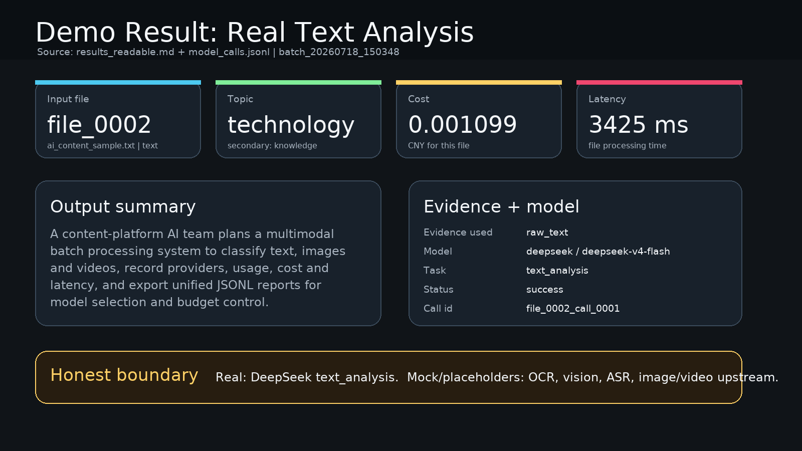
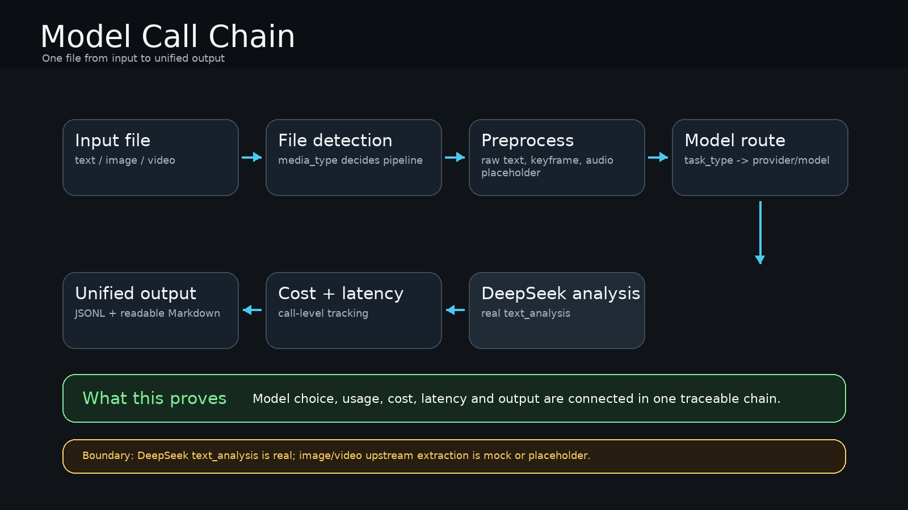
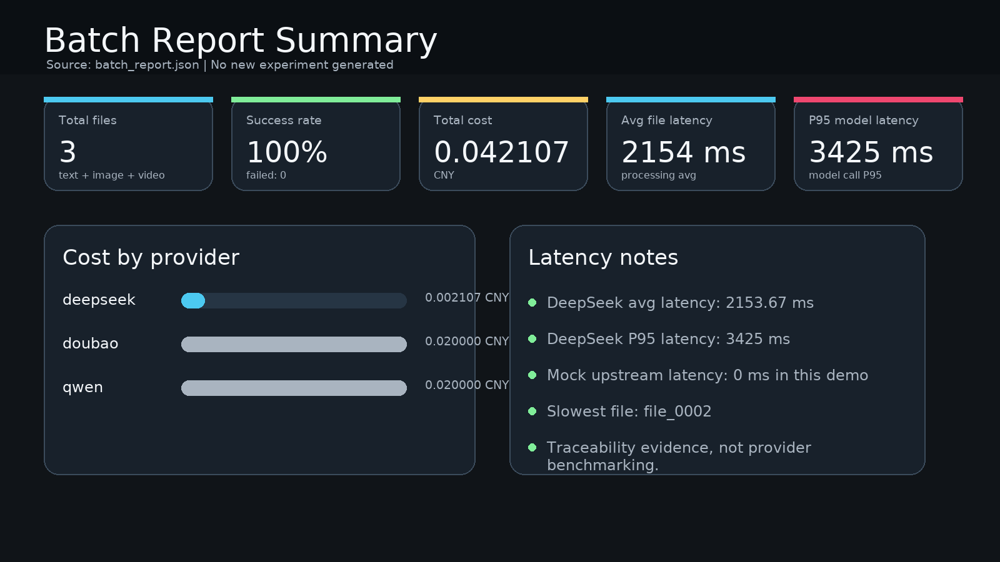

# Portfolio Showcase

这是一份给招聘方快速浏览的 3 分钟版本。它不替代 README，只负责让对方快速判断：这个项目做了什么、证据在哪里、边界是什么。

## 1. 项目价值

这个项目面向内容平台 AI 团队技术负责人，解决的是批量处理文本、图片和视频时的模型使用管理问题。

它不是普通内容分类器，而是把“调用模型”这件事做成可追踪流程：统一输入、统一输出、模型调用记录、成本核算、延迟统计和证据链追踪。



## 2. 技术亮点

- 支持文本、图片、视频三类输入进入统一批处理流程。
- 按文件类型拆分处理流水线：文本直接分析，图片走 OCR 和视觉理解，视频走 OCR、视觉理解和语音识别。
- 接入 DeepSeek 进行真实文本分析，并约束模型输出固定结构。
- 记录每次模型调用的供应商、模型、输入输出用量、成本、延迟和状态。
- 生成机器可读的 JSONL 文件，也生成适合展示的 Markdown 解读文件。



## 3. Demo 证据

当前可展示批次：

```text
output/batch_20260718_150348/
```

本批次包含 3 个文件：1 个文本文件、1 个图片文件、1 个视频文件。系统共记录 8 次模型调用，并生成 6 类输出文件。

关键输出文件：

| 文件 | 用途 |
|---|---|
| `results_readable.md` | 给人看的结果页，展示每个文件的分类、摘要、证据、成本和耗时 |
| `model_calls.jsonl` | 给技术负责人看的模型调用明细，用来追踪每次调用的供应商、模型、成本和延迟 |
| `batch_report.json` | 给批次复盘看的统计报告，用来查看总成本、成功率和 P95 延迟 |

关键字段说明：

| 字段 | 含义与作用 |
|---|---|
| `call_id` | 单次模型调用的唯一标识，用来从最终结果反查调用链路 |
| `provider` | 模型供应商，用来按供应商汇总成本和延迟 |
| `model_name` | 具体模型名称，用来确认某个结果来自哪个模型 |
| `cost_cny` | 单次模型调用成本，单位人民币，用于成本核算 |
| `latency_ms` | 单次模型调用延迟，单位毫秒，用于性能分析 |

## 4. 成本与延迟



当前 Demo 批次的关键数字：

| 指标 | 数值 |
|---|---:|
| 文件数 | 3 |
| 成功率 | 100% |
| 总成本 | 0.042107 元 |
| 平均每文件成本 | 0.014036 元 |
| 平均文件处理耗时 | 2154.33 ms |
| 模型调用 P95 延迟 | 3425 ms |

这些数字来自现有 `batch_report.json`，没有重新跑实验，也没有伪造新结果。

## 5. 真实与 mock 边界

当前真实部分：

- DeepSeek 文本分析真实调用。
- 文本分析输出主分类、副分类、关键词、摘要和业务用途。
- DeepSeek 调用记录中包含输入 token、输出 token、成本估算和真实延迟。

当前 mock 或占位部分：

- OCR 仍是 mock，不是真实图片文字识别。
- 视觉理解仍是 mock，不是真实图像理解。
- 语音识别仍是 mock，不是真实音频转写。
- 视频预处理仍是占位，不代表完整视频理解能力。

这意味着：当前项目可以展示 AI 工程化、模型调用追踪、成本延迟统计和文本分析真实接入；不能宣称已经完成全真实多模态平台。

## 6. 简历表达

多模态批处理与模型路由平台：面向内容平台 AI 团队技术负责人，设计并实现文本、图片、视频统一处理 MVP，支持文件识别、任务流水线拆解、DeepSeek 文本分析真实调用、模型调用明细记录、成本核算、延迟统计、证据链追踪和批次报告输出。项目通过模型调用明细记录供应商、模型、用量、成本和延迟，通过批次报告汇总成本与 P95 延迟，用于辅助模型选型、预算评估和内容结构化流程验证。

## 7. 面试讲法

可以这样讲：

> 我做的不是单点内容分类，而是把内容平台批量使用大模型的过程做成可追踪系统。输入是文本、图片和视频，系统会按文件类型拆流水线，调用对应模型，并把每次模型调用的供应商、模型、成本、延迟和状态记录下来。当前真实接入 DeepSeek 文本分析，图片和视频上游还是 mock；所以我会把这个版本定义为多模态批处理和模型使用追踪 MVP，而不是全真实多模态平台。

一句话重点：

> 这个项目体现的是 AI 产经里的“模型能力、成本、延迟、路由和可追踪性”意识。
